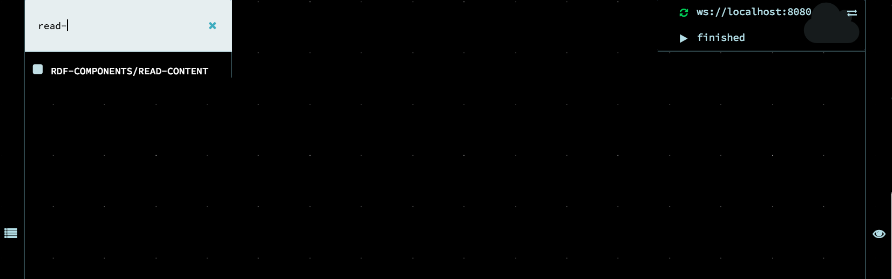
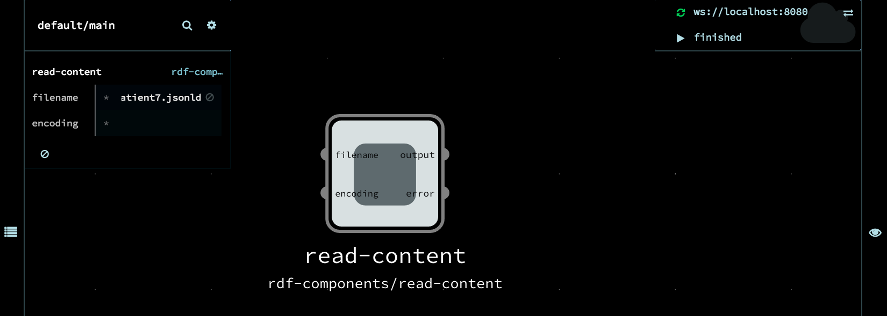
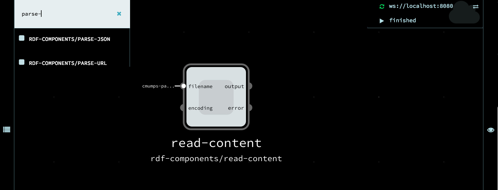
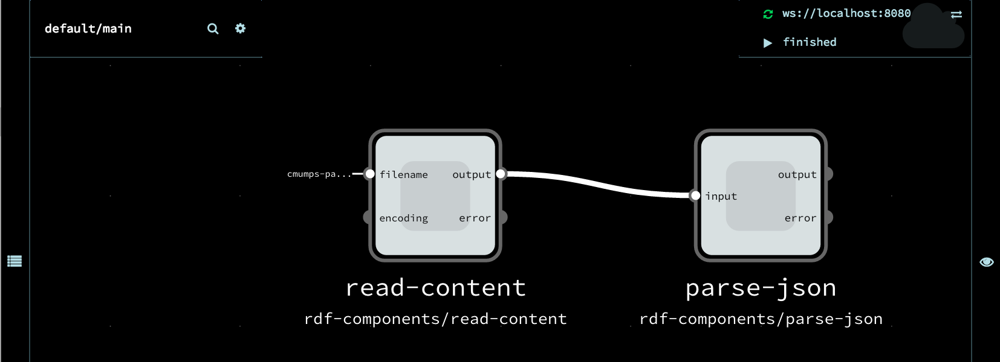
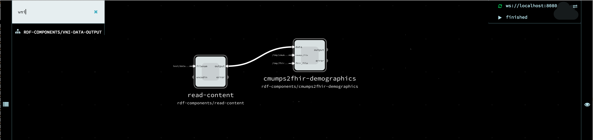
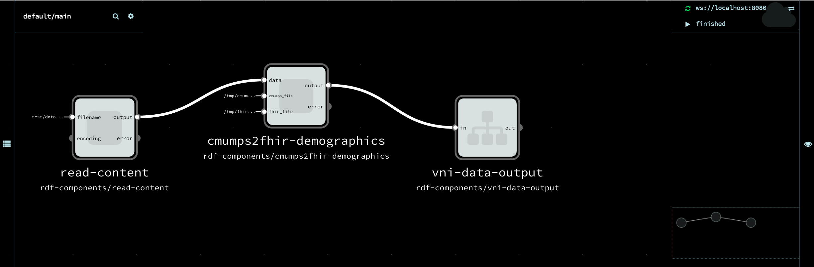
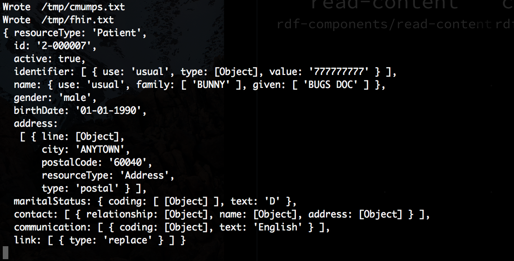

This page walks you through the process of getting a simple data transformation pipeline running in the RDF Pipeline Framework.

# Table of Contents

 * [Background](#background-concepts)
 * [Getting Started](#getting-started)
 * [Graph Node Inspector Tool](#node-navigator)

# Prerequisites
* [Installation](./Installation) 

# Background concepts

The RDF Pipeline Framework allows dataflow pipelines to be created and executed.  A pipeline is a directed graph of nodes, in which each node can process and store data, and a connection from node X to node Y means that data flows from X to Y.  If a node's input changes, the Framework will fire the node's "updater", which is responsible for updating that node's state.  If the updater changes the node's state, the Framework notifies downstream nodes, which may in turn cause the updaters of those nodes to fire.  Thus, state changes are automatically propagated through the pipeline according to the data dependencies expressed by the pipeline graph, in much the same way that [make](https://en.wikipedia.org/wiki/Make_(software)) or [ant](https://en.wikipedia.org/wiki/Apache_Ant) run commands to update files when their dependencies change.

# A Pipeline  

## Read, Transform, Write

In this section, we'll create a pipeline, with multiple nodes and edges, that transforms data and uses the RDF Pipeline Framework -- not just NoFlo.   The pipeline will read from a file in `.jsonld` format, extract a section of the file, write it to intermediate locations and then summarize the computation.  Each node in this pipeline is created from a pre-existing component.  Later we will see how you can create your own components by defining your own updaters. 

## Wire It Up

We'll do each node and edge in turn:

1. Add the _rdf-components/Read-Content_ component by clicking on the "default/main" link in the upper left hand corner of the page and typing the first few letters _Read-_.  Click on the full component name to select it and drag it to wherever you like on the page.

2. Configure the _Read Content_ to read file [test/data/cmumps-patient7.jsonld](https://github.com/rdf-pipeline/translators/blob/master/data/fake_cmumps/patient-7/cmumps-patient7.jsonld)  by clicking on the component.
A configuration view will appear in the upper left hand corner.  Click into the File field and type in this file path: `data/test/cmumps-patient7.jsonld`. This path assumes you are running noflo-nodejs from within the directory of the noflo-rdf-components directory; you may need to modify it if you're starting from a different working directory.

3. Add the _rdf-components/Parse-Json_ component by clicking on the "default/main" link in the upper left hand corner of the page and typing the first few letters _Parse-_. (Don't forget the hyphen `-` or you may accidentally pick the strings/parsejson component!)   Click on the full component name to select it and drag it to wherever you like on the page.

4. Link the _Read-Content_ and _Parse-Json_ component by clicking on the output port of _Read-Content_ and dragging the mouse to the input port of _Parse-Json_.

5. Add the _rdf-components/cmumps2fhir-demographics_ component by clicking on the "default/main" link in the upper left hand corner of the page and typing the first few letters _cmumps2fhir-_.  Click on the full component name to select it and drag it to wherever you like on the page.

6. Configure the cmumps2fhir-demographics component with an output file for the CMUMPS data (cmumps_file: /tmp/cmumps.txt) and the FHIR data translation (fhir_file: /tmp/fhir.txt) so you can examine them later after the graph runs.

7. Draw a link between the _parse-json_ component output port, and the data input port on the _cmumps2fhir-demographics_ component by clicking on the output port and dragging the mouse over the data port.

8. Add the _rdf-components/vni-data-Output_ component by clicking on the "default/main" link in the upper left hand corner of the page and typing the first few letters _VNI-_.  Click on the full component name to select it and drag it to wherever you like on the page.

9. Draw a link between the _cmumps2fhir-demographics_ component output port, and the data input port on the _VNI-Data-Output_ component by clicking on the output port and dragging the mouse over the input port of the _vni-data-ouput_ component.

10. Execute the graph by clicking on the green arrow at the upper right corner of the page.   When it says "Finished", look at the window where you ran the noflo-server.  It should look something like this: 

11. Take a look at the /tmp/fhir.txt and /tmp/cmumps.txt files you configured and verify the content looks appropriate.  A recent line count looked like this: 
wc /tmp/fhir.txt /tmp/cmumps.txt 
      48     190    1675 /tmp/fhir.txt
      60     283    2945 /tmp/cmumps.txt
     108     473    4620 total

12. Terminate the noflo-server by entering a control-C.

So far: we've done a "load and extract" program. It's convenient that the input data is in jsonld format, nonetheless we still need a component that understnd the semantics of the input and can extract the demographics. In general, as an application developer, you know your data's layout and format.
LPI simplifies the plumbing and lets you reuse commonly occurring patterns.

# TODO
@@ TODO: 1. Use a node with two inputs, so that the user will see that it waits until both inputs are ready before firing the updater.  2. Show how to write your own updater and component @@

# Node Navigator

The develop branch of df-pipeline/noflo-nodejs includes some monitoring tools located (by default) at [localhost:3569/node/](http://localhost:3569/node/). This service provides a navigable node path with edges as Web links. It also includes some statistics about rdf-pipeline nodes.

# Conclusion

You've completed the walkthrough. You got the simplest graph to run (no nodes, no edges), a few "hello" graphs to run and finally something simple but representative, a graph that extracts some data.

# References
1. [The RDF Pipeline Framework: Automating Distributed, Dependency-Driven Data Pipelines](http://dbooth.org/2013/dils/pipeline/Booth_pipeline.pdf).  Provides concepts and background on the RDF Pipeline Framework, though the examples use the Perl/Apache version.
5. [NoFlo](http://noflojs.org/documentation/) itself, specifically [components](http://noflojs.org/documentation/components/) and [graphs](http://noflojs.org/documentation/json/). Graphs are what you will run/execute/evaluate.
4. [flow based programming (paywall)](https://www.amazon.com/dp/B004PLO66O) and its [support in noflo](http://www.jpaulmorrison.com/fbp/noflo.html).
   (This is more advanced and can await later review.)
2. [node](https://nodejs.org/) and [npm](https://www.npmjs.com/) to install noflojs and any additional modules of interest for your own application development. You don't need to be a node guru, however, to get started.
3. [gruntjs](http://gruntjs.com/), a javascript task runner. You can live without knowing much grunt, but as you progress with the RDF Pipeline Framework, you might want to add your own tasks. (Currently the installation doesn't specifically use grunt, but that may change.)
6. [VirtualBox](http://www.virtualbox.org/) Optionally, you may want to install noflo on a virtual machine that you can ssh into.
