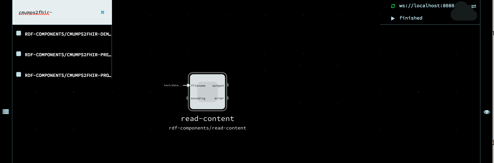
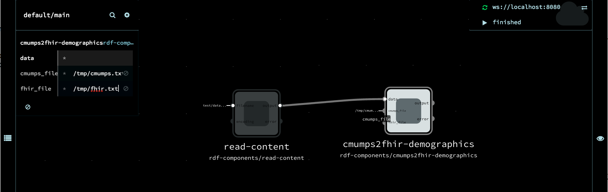

This page walks you through the process of getting a simple data transformation pipeline running in the RDF Pipeline Framework.

# Table of Contents

 * [Background](#background-concepts)
 * [Getting Started](#getting-started)
 * [Graph Node Inspector Tool](#node-navigator)


# Prerequisites
* [Installation](./Installation.md) 

# Background concepts

The RDF Pipeline Framework provides:
- a grapical way to describe dataflow pipelines
- a collection of components for use in data pipelines
- a means of executing a dataflow pipeline.

A pipeline is represented as a directed graph of nodes, in which each node can process and store data.
- A connection from node X to node Y means that data flows from X to Y.  
- If a node's input changes, the node will fire the its "updater", which is responsible for updating that node's state.  
- When an updater changes a node's state, the Framework notifies any downstream nodes, which may in turn cause the updaters of those nodes to fire, and so on.  
- Thus, state changes are automatically propagated through the pipeline according to the data dependencies expressed by the pipeline graph, in much the same way that build systems like [make](https://en.wikipedia.org/wiki/Make_(software)) or [ant](https://en.wikipedia.org/wiki/Apache_Ant) update their output when the source files change.

# A Pipeline  

## Read, Transform, Write

In this section, we'll create a pipeline that transforms data, using the custom components provided by the RDF Pipeline Framework -- and not just the basic components provided in NoFlo.   The pipeline will read from a file in `.jsonld` format, extract a section of the file, write it to intermediate locations and then summarize the computation.  Each node in this pipeline is created from a pre-existing component.  Later you will learn how you to create your own components by defining your own updaters. 

## Wire It Up

We'll do each node and edge in turn:

1. Add the `RDF-COMPONENTS/READ-CONTENT` component by clicking on the `default/main` link in the upper left hand corner of the page and typing the first few letters, "read-".  Click on the full component name to select it and add a new node to the canvas.


2. Configure the `READ-CONTENT` component to read file [test/data/cmumps-patient7.jsonld](https://github.com/noflo-rdf-pipeline/blob/master/test/data/cmumps-patient7.jsonld)  by clicking on the `read-content` node that appeared on the canvas, and editing the `filename` field in the configuration view that appears in the upper left hand corner.  Click into the `filename` field and type in this file path: `test/data/cmumps-patient7.jsonld` 

This path assumes you are running noflo-nodejs from within the directory of the noflo-rdf-components directory; you may need to modify it if you're starting from a different working directory.


3. Add the `RDF-COMPONENTS/CMUMPS2FHIR-DEMOGRAPHICS` component by clicking on the `default/main` link in the upper left hand corner of the page and typing the first few letters, "cmumps2fhir-".  Click on the full component name to select it and add it to the canvas. Then, drag it to wherever you like on the page.


4. Create a data flow path between the two components. Click on the `read-content` node's `output` port, and drag the mouse over to the `cmumps2fhir-demographics` node's `data` port, then release the mouse button.


5. Click on the `cmumps2fhir-demographics` node to configure the component with an output file for the CMUMPS data (cmumps_file: /tmp/cmumps.txt) and the FHIR data translation (fhir_file: /tmp/fhir.txt). That way, we can examine them later after the graph runs.



6. Add the `RDF-COMPONENTS/VNI-DATA-OUTPUT` component by clicking on the `default/main` link in the upper left hand corner of the page and typing the first few letters, "vni-".  Click on the full component name to select it and add it to the canvas. Then, drag it to wherever you like on the page.


7. Create a link between the `CMUMPS2FHIR-DEMOGRAPHICS` component's output and the `VNI-DATA-OUTPUT` component's input by clicking on the `cmumps2fhir-demographics` node's `output` port and dragging the mouse over to the `in` port of the `vni-data-ouput` node.


8. Execute the graph by clicking on the green arrow at the upper right corner of the page.   When it says "Finished", look at the window where you ran the noflo-server.  It should look something like this: 


9. Take a look at the /tmp/fhir.txt and /tmp/cmumps.txt files you configured and verify the content looks appropriate.  A recent line count looked like this: 

```
wc /tmp/fhir.txt /tmp/cmumps.txt 
      49     192    1682 /tmp/fhir.txt
      60     283    2945 /tmp/cmumps.txt
     109     475    4627 total
```

10. Terminate the noflo-server if you'd like to change the file that the graph is stored in.

So far: we've done a "load and extract" program. It's convenient that the input data is in jsonld format, nonetheless we still need a component that understnd the semantics of the input and can extract the demographics. In general, as an application developer, you know your data's layout and format.
NoFlo simplifies the plumbing and lets you reuse commonly occurring patterns.

# Node Navigator

The develop branch of df-pipeline/noflo-nodejs includes some monitoring tools located (by default) at [localhost:3569/node/](http://localhost:3569/node/). This service provides a navigable node path with edges as Web links. It also includes some statistics about rdf-pipeline nodes.

# Conclusion

You've completed the walkthrough. You got the simplest graph to run (no nodes, no edges), a few "hello" graphs to run and finally something simple but representative, a graph that extracts some data.

# TODO
@@ TODO: 1. Use a node with two inputs, so that the user will see that it waits until both inputs are ready before firing the updater.  2. Show how to write your own updater and component @@


# References
1. [The RDF Pipeline Framework: Automating Distributed, Dependency-Driven Data Pipelines](http://dbooth.org/2013/dils/pipeline/Booth_pipeline.pdf).  Provides concepts and background on the RDF Pipeline Framework, though the examples use the Perl/Apache version.
5. [NoFlo](http://noflojs.org/documentation/) itself, specifically [components](http://noflojs.org/documentation/components/) and [graphs](http://noflojs.org/documentation/json/). Graphs are what you will run/execute/evaluate.
4. [flow based programming (paywall)](https://www.amazon.com/dp/B004PLO66O) and its [support in noflo](http://www.jpaulmorrison.com/fbp/noflo.html).
   (This is more advanced and can await later review.)
2. [node](https://nodejs.org/) and [npm](https://www.npmjs.com/) to install noflojs and any additional modules of interest for your own application development. You don't need to be a node guru, however, to get started.
3. [gruntjs](http://gruntjs.com/), a javascript task runner. You can live without knowing much grunt, but as you progress with the RDF Pipeline Framework, you might want to add your own tasks. (Currently the installation doesn't specifically use grunt, but that may change.)
6. [VirtualBox](http://www.virtualbox.org/) Optionally, you may want to install noflo on a virtual machine that you can ssh into.
