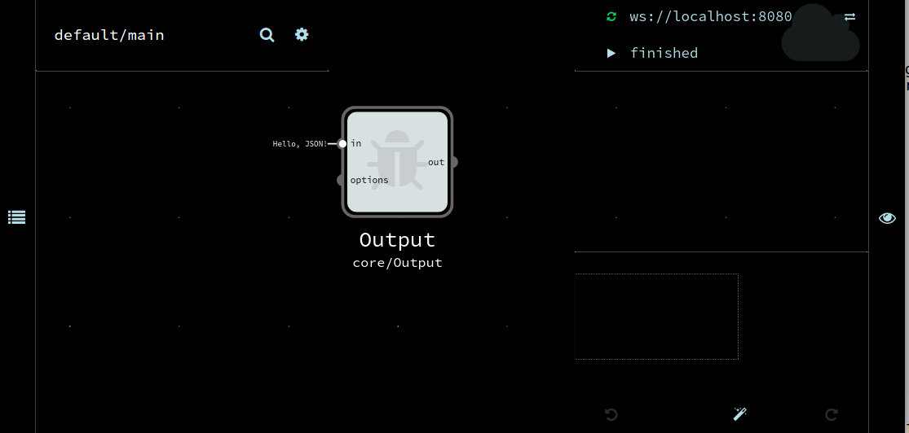

# Installation

The RDF Pipeline Framework is layered on node.js lts/argon (v4.8.0 as of this writing) and the following noflo components:
 * noflo-nodejs - _the noflo engine_
 * noflo-ui - _the noflo frontend_ 

These instructions will guide you through installing those and then linking up our custom RDF Pipeline Framework [components](../noflo-rdf-components).

The RDF Pipeline Framework has been tested on Linux platforms: Centos 7.1, Ubuntu 14.04 and Ubuntu 16.04 and on Mac OSX: El Capitan 10.11.6 

This sequence of steps installs the noflo version of the RDF Pipeline Framework on your local Linux/Mac computer. 

## 1. (Optional) Install a VM.
Optionally, install Centos 7.1 or Ubuntu 16.04 as virtual machine. Make your network device "bridged" so you can ssh into the virtual machine.

## 2. Install java jdk
Java is only used by some pipelines, but if the JDK isn't installed then later attempts to run ```npm install``` will fail.  See [issue 74](https://github.com/rdf-pipeline/noflo-rdf-pipeline/issues/74).  These commands worked on CENTOS 7:

```bash
sudo yum install java-1.7.0-openjdk
sudo yum install java-devel
```

This command worked on OSX with homebrew installed:

```bash
brew cask install caskroom/versions/java7
```

## 2. Install nodejs LTS 'argon' (version 4.x) and grunt
You can install the nodejs long term support version using [nvm](http://nvm.sh), through your platform's package manager, or directly from source. 

NVM has the benefit that it will ensure you know the version you're running, though it is a little more involved. Instructions for installing using NVM are included below.

The [node website](https://nodejs.org/en/download/package-manager/) has instructions for using different operating systems' package managers for installation. Note that not all of these will install the argon LTS version of node (4.x). To test which version your OS is using, type `node --version` at the command prompt.

Finally, if you prefer to install nodejs directly, you can download the sources or package for argon 4.x from the [nodejs website](https://nodejs.org/dist/latest-v4.x/).

a. Install and configure nvm:

```bash
curl -o- https://raw.githubusercontent.com/creationix/nvm/v0.33.1/install.sh | bash

# The above script automatically adds the following lines to your profile, which need to be run manually for the current session:
export NVM_DIR="$HOME/.nvm"
[ -s "$NVM_DIR/nvm.sh" ] && . "$NVM_DIR/nvm.sh"  # This loads nvm

```
c. Install nodejs LTS argon - v4.x:

```bash
nvm install lts/argon
```

d. Test it:

```bash
node --version # report the version
#=> 4.8.0      # as of the creation of this document

node -p -e 'process.cwd()' # run a one-liner
#=> /home/your_user_name
```

e. Install grunt:

```bash
npm update -g npm
npm install -g grunt
npm install -g grunt-cli
```

## 3. Install noflo-ui from the RDF Pipeline Framework
Clone the noflo-ui repository and checkout the develop branch. Follow the instructions in the README.md to install the branch globally via npm link.   See also [Troubleshooting](Troubleshooting.md).

```bash
# go to home directory...replace with directory of your chosing
cd ~

git clone https://github.com/rdf-pipeline/noflo-ui.git
cd noflo-ui
git checkout develop
npm install
npm install --save-dev coffee-script
npm update
grunt build
npm link
```

## 4. Install noflo-nodejs from the RDF Pipeline Framework
Clone the noflo-nodejs repository and checkout the develop branch. Follow the instructions in the README.md to install the branch globally via npm link.

```bash
# go to home directory...replace with directory of your chosing
cd ~

git clone https://github.com/rdf-pipeline/noflo-nodejs.git
cd noflo-nodejs
git checkout develop
npm install
npm link
```

## 5. Install noflo-rdf-components from the RDF Pipeline Framework
Clone the noflo-rdf-components repository and checkout the develop branch. Then add the noflo-nodejs to the project.

```bash
# go to home directory...replace with directory of your chosing
cd ~

git clone https://github.com/rdf-pipeline/noflo-rdf-components.git
cd noflo-rdf-components
git checkout develop
npm install
npm link noflo-nodejs
```

## 6. Test your installation

The JavaScript version of the RDF Pipeline Framework uses NoFlo on top of Node.js, so before we start transforming data, let's see if NoFlo works.

The simplest graph to run has no nodes and no edges, and therefore doesn't do anything. We use it to test that the NoFlo server and user interface will spin up.

Once you're sure it does, your own graphs will be easier to debug.

A few brief caveats:

1. For these examples, node.js was installed using using the node version manager [nvm](https://www.npmjs.com/package/nvm).  Nvm lets you run multiple versions of node on a single machine so that you can switch between them.  (Currently the RDF Pipeline Framework runs over nodejs argon 4.x, the "long term support" version, as do these examples. ) 

2. The next set of commands make sure you are running the version of node and the noflo server you expect. You may have to issue slightly different commands for your shell.  The commands below used `bash`.

3. You may want to race ahead immediately. We suggest you don't. NoFlo is powerful and has several moving parts. Be methodical.

4. NoFlo generally doesn't log to standard error, leaving that to individual components. It's easy, therefore, for something to be misconfigured and fail silently. Our "small steps, bottom up" approach mitigates some of that potential confusion, especially if you are used to other servers that do logging differently.

5. Finally, this may look like web development, but in reality, NoFlo lets us compose functionality on the backend. Thus, "console" generally refers to the terminal where we're running noflo-nodejs and not the web inspector console.

Since we use NoFlo to assemble the RDF Pipeline, let's first make sure we can run the NoFlo server and frontend:

```bash
type -p node  # dude, where's my node? -p reports the path
#=> /home/your_user_name/.nvm/versions/node/v4.8.0/bin/node

node --version # yup, that's the version
#=> v4.8.0

type -p noflo-nodejs # dude, where's my noflo-nodejs?
#=> /home/your_user_name/.nvm/versions/node/v4.8.0/bin/noflo-nodejs

type -p noflo-ui # dude, where's my noflo-ui?
#=> /home/your_user_name/.nvm/versions/node/v4.8.0/bin/noflo-ui

```

If your shell found the executables and version of node we expected, let's run an empty NoFlo graph. 


Run noflo-ui and noflo-nodejs from within the noflo-rdf-components directory:

```bash
# enter the directory for the repository containing all our custom components
cd noflo-rdf-components
# create an empty JSON graph
echo "{}" > output.json

# Start the NoFlo Engine
noflo-nodejs --register false --ide http://localhost:8080/ --secret secret --graph output.json --save-graph output.json &

#Start the NoFlo UI
noflo-ui --secret secret --host localhost --port 8080 --websocket ws://localhost:3569 &

```

If the noflo-nodejs and noflo-ui commands don't work, you may have to specify the full path, source your .profile/.bash_profile file, or run the commands as in 2a, above, to initialize NVM.

The UI can now be accessed by browsing to [localhost:3569](http://localhost:3569/) and an interface to view and inspect the nodes in the current graph is available at: [localhost:3569/node/](http://localhost:3569/node/) . 

**Explanation:**
* If you've used NoFlo with FlowHub before, you might be wondering what's going on. Our components are not compatible with the stock NoFlo UI code, so we've *forked* the repoistories from the NoFlo project and are running them from a local clone of our repository that contains a number of custom components. 
* There are two servers running--on two different ports. :3569 is serving the NoFlo runtime backend, and :8080 is serving the NoFlo GUI  being used. When you browse to `localhost:3569`, it forwards you to the GUI that's available on `localhost:8080`. You can browse there as well, if you prefer.  
* We have a custom interface to show a list of nodes in the current pipeline (empty at first). For historical reasons, this interface is available on the same port as the NoFlo runtime, but at a different path. Browsing to `localhost:3569/node` will open this page. Once there are nodes listed, you can see detailed information about each node by clicking on it.

Now point your web browser at [localhost:3569](http://localhost:3569/). You should see no nodes, no edges and the execution will be finished. It will resemble something like this:


By clicking the name of the graph ( where it says `default/main` in the top left ), you should see a list of components that you can filter through by typing. 

Some basic components included with noflo are prefixed with `CORE`, such as `CORE/CALLBACK`. 

Many of our components start with the prefix `RDF-COMPONENTS`, such as `RDF-COMPONENTS/ADD-METADATA`.

If you see a long list of components that includes both of these examples, then your installation is likely successful. Let's try to create and run a graph to be sure.

** Notes: **
* We started the NoFlo servers in the background earlier. If you wish to exit those processes, use the command `fg` to bring the process to the foreground, followed by `control-C`. Alternatively, you may use `ps aux |grep node` to list all running node instances, so you can find the PID and issue the `kill` command to end the process of your choosing.
* You may wish to run the two NoFlo servers in the foreground of different terminal windows, screens, tmux psuedo terminals, etc so that you can easily see the output, any error messages that may come up, and end the process with `control-C`.


## 7. Running a simple graph

We just created an empty JSON graph `output.json`.   In a moment we will add to it. If you've already started editing the graph, you may wish to kill the noflo-nodejs server and re-run the following before continuing:

```bash
# create an empty JSON graph, overwriting any that may be there already
echo "{}" > output.json
# Start the NoFlo Engine
noflo-nodejs --register false --ide http://localhost:8080/ --secret secret --graph output.json --save-graph output.json
```

Open [localhost:3569](http://localhost:3569/) in your browser, click the `default/main` label and select the `CORE/Output` component to create a node in the graph.  The quickest way to find it is by typing part of the name, selecting the component when it appears in the list.

Once the component appears on the canvas (represented as a node with inputs and outputs), click on it to show the inspector. In the text box labeled `in *`, type the string literal "Hello, JSON" to send in that as a hard-coded input. It should look like this:



Having set up the graph, we run it by clicking the light blue "Run" triangle in the upper right corner. 

At the command line where we ran noflo-nodejs we see:

```
Hello, JSON!
```

Note that the `CORE/Output` component writes to standard output. In a later exercise, we'll write to the user interface directly.

If we exit noflo-nodejs with `control-C`, we shall find that noflo has saved the modified graph for us in the JSON file:

```bash
cat output.json
```

```json
{
  "properties": {},
  "inports": {},
  "outports": {},
  "groups": [],
  "processes": {
    "core/Output_cuhrg": {
      "component": "core/Output",
      "metadata": {
        "label": "Output",
        "x": 334,
        "y": 103
      }
    }
  },
  "connections": [
    {
      "data": "Hello, JSON!",
      "tgt": {
        "process": "core/Output_cuhrg",
        "port": "in"
      }
    }
  ]
}
```

You can create or edit these JSON graph definitions by hand if you want.  You can also use `.fpb` files (flow-based-programming) instead of JSON, but we will not discuss that format here.

After you have installed the parts, you can move on to [Getting Started](Getting-Started.md) to start building pipelines.
