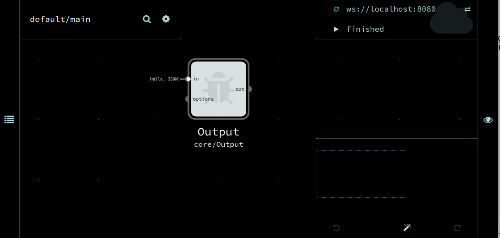

# Documentation for RDF Pipeline

The team-docs repository contains markdown files describing installation, use, and development of modules used in the rdf-pipeline project.

 * [Installation](#installation)
 * [Getting Started](#getting-started)
 * [Development Protocol](#gitflow)
 * [Best Practices](#best-practices)


## Installation

 * Currently documented [here](https://github.com/rdf-pipeline/noflo-rdf-pipeline/wiki/Installation).
 * TODO: Update to reference Argon, and include the following update to the invocation:
```bash
noflo-nodejs --register false --ide http://localhost:8080/ --secret secret --graph output.json --save-graph output.json
noflo-ui --secret secret --host localhost --port 8080 --websocket ws://localhost:3569
```
### Testing Your Installation

testing image inclusion:




## Getting Started

### Gitflow

 * Developer creates a branch or fork
 * Developer issues pull request (PR) with changes
 * Other developers review, and post comments or "LGTM" - "Looks good to me"
 * When LGTM consensus is reached, original Developer merges PR

## Best Practices
