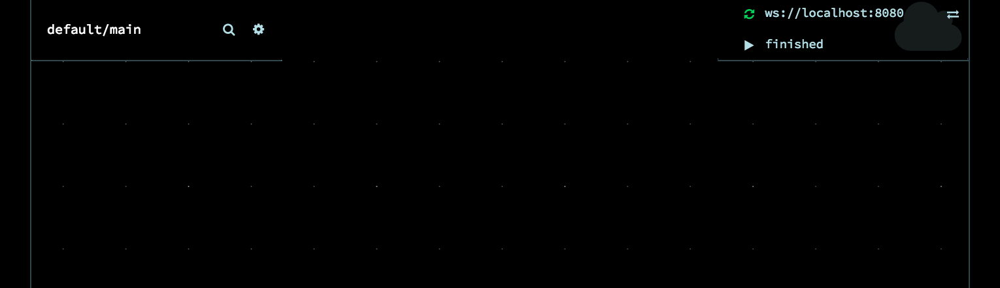

# Documentation for RDF Pipeline

The team-docs repository contains markdown files that describe installation, use, and development of modules used in the rdf-pipeline project.

 * [Installation](#installation)
 * [Getting Started](#getting-started)
 * [Development Protocol](#gitflow)
 * [Best Practices](#best-practices)


## Installation

This is the quick guide, [click here for the full instructions](Installation.md)

1. Install Prerequisites
   * (optional) Linux VM - Centos/Ubuntu
   * (optional) nvm - node version manager
   * java jdk 1.7
   * node.js LTS "argon" (version 4.8 as of this writing)

2. Clone needed repositories, checking out 'develop' branch

```bash
git clone https://github.com/rdf-pipeline/noflo-nodejs.git -b develop
git clone https://github.com/rdf-pipeline/noflo-ui.git -b develop
git clone https://github.com/rdf-pipeline/noflo-rdf-components.git -b develop
```
3. Install noflo-nodejs:
   
```bash
cd noflo-nodejs
npm install
npm link
cd ..
```
4. Install noflo-ui:

```bash
cd noflo-ui
npm install
grunt build
npm link
cd ..
```
5. Install noflo-rdf-components: 
   
```bash
cd noflo-rdf-components
npm install
npm link noflo-nodejs
```

6. run an empty NoFlo graph for testing

```bash
# enter the directory for the repository containing all our custom components
cd noflo-rdf-components
# create an empty JSON graph
echo "{}" > output.json
# Start the NoFlo Engine
noflo-nodejs --register false --ide http://localhost:8080/ --secret secret --graph output.json --save-graph output.json &
#Start the NoFlo UI
noflo-ui --secret secret --host localhost --port 8080 --websocket ws://localhost:3569 &
```
 
### Testing Your Installation

The noflo-nodejs script runs a local NoFlo runtime, and--in our fork--serves up a web page to inspect the status of active nodes at [localhost:3569/node/](http://localhost:3569/node/).

The noflo-ui script runs the frontend, which connects to the runtime. Browsing to [localhost:3569](http://localhost:3569/) should automatically forward to the UI, which is served from [localhost:8080](http://localhost:8080/).  This is the interface where you will create your pipeline graph. Currently it should be empty, and look something like this:



By clicking the name of the graph ( where it says `default/main` in the top left ), you should see a list of components that you can filter through by typing. 

Some basic components included with noflo are prefixed with `CORE`, such as `CORE/CALLBACK`. 

Many of our components start with the prefix `RDF-COMPONENTS`, such as `RDF-COMPONENTS/ADD-METADATA`.

If you see a long list of components that includes both of these xamples, then your installation is likely successful. Let's try to create and run a graph to be sure.

## Getting Started

TODO - Quick Guide
[Full Guide]](Getting-Started.md)


### Gitflow

 * Developer creates a branch or fork
 * Developer issues pull request (PR) with changes
 * Other developers review, and post comments or "LGTM" - "Looks good to me"
 * When LGTM consensus is reached, original Developer merges PR

## Best Practices
